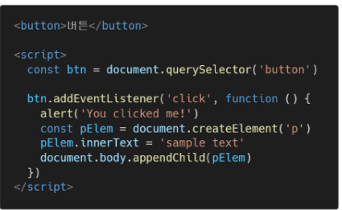
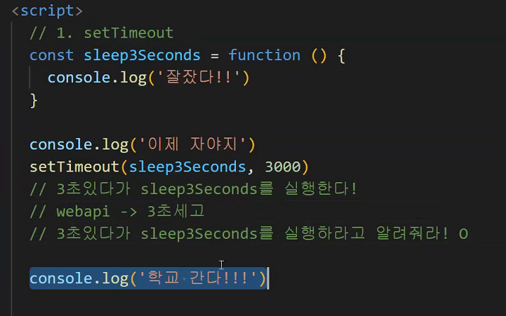
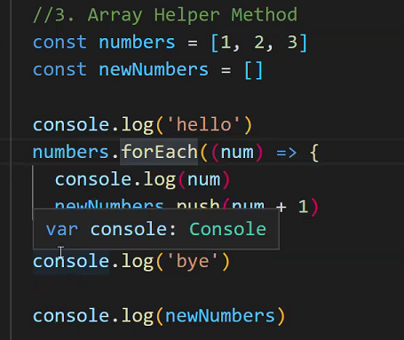

# 0503TIL


### AJAX (Asynchronous Javascript And XML) 비동기식 js와 xml

#### AJAX ?

* 서버와 통신하기 위해 XMLHttpRequest 객체를 활용한다. 

  * XMLHttpRequest -> 동기식 비동기식 통신 모두 다 지원한다.

    * | 동기식                                             | 비동기식                                         |
      | -------------------------------------------------- | ------------------------------------------------ |
      | 요청이 있으면, 응답할 때까지 다른 요청/업무 수행 X | 요청 -> 응답 오지 않아도 다른 요청/업무 수행가능 |
      | one by one 하나 끝내야 다음 일 진행 가능           | 무수한 요청이 있어도 다른 일 진행 가능           |

  * 페이지 전체 reload 하지 않고 수행하는 '비동기'

    * event가 있으면 전체 페이지가 동작하는 것이 아니라 일부만 업데이트 한다.

      * ex) 구글 맵 - 지도 확대/축소 하면 해당 부분만 변화, 전체 페이지 업데이트 X

      

* XMLHttpRequest object

  * (AJAX의 X-> XML), 이름은 XML로 시작하지만, XML 뿐만 아니라 모든 종류 데이터 받는거 가능

  * 서버와 상호작용하는데 사용되고, 전체 페이지 새로고침 없이 URL에서 데이터 받아오는 것이 가능하다.

  * 사용자를 방해하지 않으면서 페이지 일부 업데이트 가능

    * ```
      const request = new XMLHttpRequest()
      const URL = 'https://naver.com'
      
      request.open('GET', URL)
      request.send()
      
      const todo = request.response
      console.log(todo)
      ```

  

* 동기와 비동기

  * 왜 비동기를 사용할까

    * 사용자 경험을 위해 사용
    * 동기식 코드일 경우, 데이터 로드가 끝난 후에 앱이 실행되는데, 데이터가 많은 경우 로드되는 동안 앱을 사용할 수 없는 상태로 언제 로드가 끝날지 모르는 로딩 시간을 기다려야한다.
    * 동기식 -> 화면 멈춘거 같아보임. 코드실행 멈추고 화면 응답하지 않는 사용자 환경
    * 그래서 비동기 코드를 사용한다.

  * 동기/비동기 예시

    * 동기

    * 

      * 버튼 클릭 후 alert 확인 버튼 누를 때까지 문장 안 만들어짐
      * alert 처리 전까지 실행되지 않음
      * JS는 single threaded기 때문

    * 비동기

      * ```
        const request = new XMLHttpRequest()
        const URL = 'https://naver.com'
        
        request.open('GET', URL)
        request.send()
        
        const todo = request.response
        console.log(todo)
        ```

      * 요청 보내고 응답 안 기다리고 다음 코드 실행

      * 변수 todo에는 응답데이터 할당 안되고, 빈 문자열 출력

      * 왜 안기다림? -> JS는 single threaded


* Threads
  * 프로그램이 작업 완료하는데 사용할 수 있는 단일 프로세스!!
  * 한번에 하나의 작업만 수행 가능
  * 다음 작업 시작하려면 앞의 작업이 완료되야함
  * 처리 못하는 이벤트는 다른 곳(Web API)로 보내고, 처리된 애들은 처리된 순서대로 Task queue에 줄 세워놓고 Call stack 비면, Event Loop가 대기줄에서 가장 오래된 이벤트를 call stack으로 보낸다.


* Concurrency model
  * Event loop 기반으로 하는 동시성 모데데델
    * Call stack
      * 요청 들어올 때마다 처리하는 Stack(LIFO) 형태 자료구조
    * Web API(browser API)
      * JavaScript 엔진 말고, 브라우저에서 제공하는 API
      * setTimeout(), DOM event, AJAX로 데이터 가져오는 시간 소요되는 일 처리
    * Task Queue
      * 콜백 함수가 대기하는 공간, Queue(FIFO) 형태 자료구조
      * main thread 끝난 후에 실행되서 후속 JavaScript 코드 차단되는거 방지함
    * Event Loop
      * Call stack 비어있는지 확인
      * 비어있으면, Task Queue에서 대기중인 콜백 있는지 확인한다.
      * 만약 대기중인 콜백 있으면, 제일 앞에 있는 콜백을 Call stack으로 push함


* Zero delays
  * 진짜 0ms 뒤에 콜백 시작된다는 의미 X
  * 실행은 Task Queue에 대기중인 작업수에 따라 다름
  * 특정 시간 제한했어도, 대기중인 모든 코드가 완료될 때까지 대기


* 순차적 비동기 처리
  * Web API로 들어오는 순서는 중요X, 이벤트의 처리순서가 중요하다.(실행순서 명확하지 않음)
  * Async callbacks
    * 백그라운드에서 실행할 함수 호출할 때 인자로 지정한 함수
  * promise-style (어렵다.. 음)
    * XMLHttpRequest보다 더 현대적인 버전


### Callback Function

* Callback Function

  * 다른 함수에 인자로 전달된 함수
  * 동기식, 비동기식 다 사용된다.
  * 비동기 작업 완료 후 코드 실행 계속하는데 사용되는 경우 비동기 콜백
  * 명시적 호출이 아니라 routine이나 action에 의해 호출된다.
  * 비동기 로직 수행 시 콜백 함수 필수
    * '알아서' 호출되도록 해야하기 때문에 콜백 함수 활용

* JS함수는 '일급 객체'다

  * 인자 넘기는 거 가능
  * 함수 반환 값 사용 가능
  * 변수 할당 가능

  

* Callback Hell

  * 순서가 있는 연쇄 비동기 작업 처리 시 콜백함수 계속 호출하는 패턴이 반복될 때
  * 디버그, 코드 가독성이 떨어진다. 작업을 어렵게 함
  * 해결
    * 코드 깊이를 얕게
    * 모듈화 하고
    * 모든 단일 오류 처리
    * **Promise 방식 사용하기**


#### Promise

* Promise object

  * 비동기 작업 완료 or 실패 나타내는 객체다.

  * 성공 -> .then() / 실패 -> .catch()

    * .then()
      * 이전 작업(promise) 성공했을 때 수행할 작업 나타내는 콜백 함수
      * 각 콜백함수는 이전 작업의 성공 결과를 인자로 전달받는다. (콜백이니까..?)
      * 그래서 성공 시의 코드를 콜백 함수 안에 작성한다.
    * .catch()
      * .then 실패 하면 동작한다.
      * 이전 작업 실패로 생성된 error 객체는 catch 블록 안에서 사용
    * 두가지 메서드 다 promise를 반환하기에 chaining이 가능하다.
      * 연쇄적인 작업가능. 차례대로 수행 가능
      * 대신, 반환 값 반드시 있어야함. 없으면 이전 결과 못받기 때문
    * finally(callback)
      * promise 객체 반환하는데, 결과 상관없이 무조건 지정한 콜백함수 실행한다.
      * promise 성공 거절 여부 판단할 수 없어서 인자 전달 X
      * 무조건 실행되어야할 때 활용
        * .then() / .catch() 블록에서 코드 중복 방지

  * 상태

    * Pending(대기)

      * 초기 상태, 작업 처리중

    * fulfilled(이행)

      * 연산 완료

    * rejected(거부)

      * 연산 실패

      

  * Promise 기본 구조

    * resolve()

      * Promise 이행

    * reject()

      * Promise 거부

      

  * Promise 특징

    * 콜백은 JS Event Loop가 현재 실행중인 콜 스택 완료 전까지 절대 호출 X
      * Promise 콜백은 event queue에 배치되는 엄격한 순서 호출
    * .then() 여러 개 콜백 추가 가능(chaining)! 뛰어난 장점!!!
    * 비동기 작업 성공 or 실패 하고 .then() 메서드로 추가한 경우에도 첫 번째 특징대로 동작


### Axios

* Axios

  * 브라우저를 위한 Promise 기반 클라이어언트

  * ```
    const URL = 'https://naver.com'
    
    axios.get(URL)
    	.then(function (response) {
    	console.log(response)
    	return response.data
    	})
    	.then(function (data) {
    	return data.title
    	})
    	.
    	.
    	.
    ```


### async & await

* async & await
  * 비동기 코드 작성하는 새로운 방법
  * Promise 시스템 위에 구축된 syntactic sugar(>????)
    * Promise then chaining 제거!
    * ■ syntactic sugar
      * 쉽게 읽고 표현할 수 있게 설계된 프로그래밍 언어 내 구문
      * 읽는 사람이 쉽게 코드 읽을 수 있게 하는것
  * 동기코드처럼 표현하고 작동하게 하는 장점


----







* forEach -> 동기적으로 작동한다. 작동원리 꼭 기억하기 
* 여기서는 hello, 1, 2, 3, bye 순으로 출력된다.